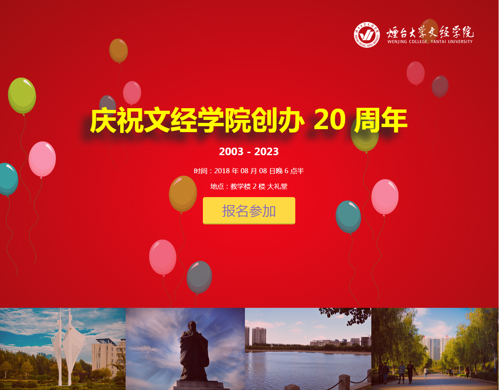
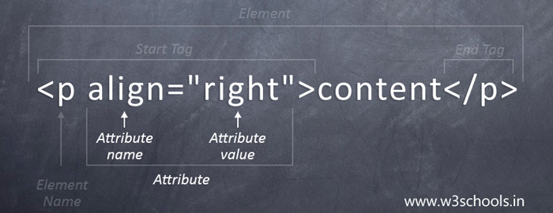

# 艾氪森 H5 公开课
2018-04

---



---

# 前台开发四门功课

- HTML
- CSS
- Javascript
- Dom

---

# Web 发展历史

- Web 诞生: HTML、URL和HTTP
- 动态内容出现：CGI
- Web 编程脚本语言：PHP / ASP / JSP
- 分布式企业计算平台：J2EE / .NET
- 框架横飞的年代：MVC，ORM
- 回归 Web 本质：REST
- 浏览器的魔术：Ajax
- 前端 MVC：Angular / Backbone
- Javascript 在服务端的逆袭：NodeJs

---


# 如何学习：学习顺序

> 先打地基，建房子（html）
然后装修（css）
接着把门，窗户，自来水龙头，电灯开关什么的接好（js）
可是还没有电，也没水，怎么办呢，造发电站，兴修水利发电站（php）
依旧没水没电，修水库，引入水源，水利发电（mysql）

https://www.zhihu.com/question/22646257/answer/102812620

---
# 如何学习：前端入门

>首先学习HTML, CSS, 这两个东西是一套的, 非常容易理解, 把w3school上面的教程过一遍就会了, 记住要一个个过, 千万不要偷懒, 一旦开始偷懒, 你会越来越偷懒, 最后什么都没学成。

https://www.zhihu.com/question/22646257/answer/22113651

- [菜鸟教程：HTML 教程](https://www.runoob.com/html/html-tutorial.html)
- [菜鸟教程：CSS 教程](https://www.runoob.com/css/css-tutorial.html)

---

## 编辑器和浏览器

Notepad++: 新建文件，输入 HTML 代码，保存为 `.html` 后缀

- 注意代码缩进
- 适当增加注释


Chrome ：打开 `.html` 文件
- 先用 `file:///` 方式打开，真实环境是用 `http://` 方式打开

---

# HTML 格式



---

# HTML 基本结构，常用元素

```
<!DOCTYPE html>
<html>

<head>
    <meta charset="utf-8">
    <title>艾氪森科技</title>
</head>

<body>

    <h1>Welcome H5</h1>

    <p>Go go go.</p>

</body>

</html>

```

---

# 基本标签（Basic Tags）

```

<h1>最大的标题</h1>
<h2> . . . </h2>
<h3> . . . </h3>
<h4> . . . </h4>
<h5> . . . </h5>
<h6>最小的标题</h6>
 
<p>这是一个段落。</p>
<br> （换行）
<hr> （水平线）
<!-- 这是注释 -->
```

---

# 链接（Links）

普通的链接：
`<a href="http://www.example.com/">链接文本</a>`

图像链接： 
`<a href="http://www.example.com/">    </a>`

邮件链接：
`<a href="mailto:webmaster@example.com">    发送e-mail</a>`

书签：
```
<a id="tips">提示部分</a>
<a href="#tips">跳到提示部分</a>
```

---

# 图片（Images）

```

```

---

# 样式/区块（Styles/Sections）

```
<style type="text/css">
h1 {color:red;}
p {color:blue;}
</style>
<div>文档中的块级元素</div>
<span>文档中的内联元素</span>
```

---
# 无序列表

```
<ul>
    <li>项目</li>
    <li>项目</li>
</ul>

```
# 有序列表

```
<ol>
    <li>第一项</li>
    <li>第二项</li>
</ol>
```
---

# 表格（Tables）

```
<table border="1">
  <tr>
    <th>表格标题</th>
    <th>表格标题</th>
  </tr>
  <tr>
    <td>表格数据</td>
    <td>表格数据</td>
  </tr>
</table>
```

---

# 表单（Forms）

```
<form action="demo_form.php" method="post/get">
  <input type="text" name="email" size="40" maxlength="50">
  <input type="password">
  <input type="checkbox" checked="checked">
  <input type="radio" checked="checked">
  <input type="submit" value="Send">
  <input type="reset">
  <input type="hidden">
  <select>
    <option>苹果</option>
    <option selected="selected">香蕉</option>
    <option>樱桃</option>
  </select>
  <textarea name="comment" rows="60" cols="20"></textarea>
</form>
```

---

## 什么是 CSS 

- 层叠样式表
- 控制 HTML 的显示
- 内容和表现分离

---
CSS 是如何工作的

[CSS in Action](http://www.runoob.com/try/demo_source/demo_default.htm)

---


# CSS 规则


https://www.runoob.com/css/css-syntax.html

---

## id 和 class 选择器

- id 是唯一的：`#main-container`
- class 选择多个元素: `.item`
- 标签选择器：`h1`
- 后代选择器: `.container h1`
- 分组选择器：`h1, h2`

---

## 创建 CSS

- 外部：`<link rel="stylesheet" type="text/css" href="mystyle.css">`
- 内部：`<style>p {margin-left:20px;}</style>`
- 内联：`<p style="color:sienna;margin-left:20px">这是一个段落。</p>`

为了网页能够正常显示，外部和内部样式都定义在 `head` 里。

---

## 背景色

`background-color: #b0c4de;`

- 16 进制颜色：`abcdef`, `eee`
- RGB 格式：`rgb(255, 0, 0)`
- 命名颜色：`red`

---

## 背景图片

`background:#ffffff url('img_tree.png') no-repeat right top;`

当使用简写属性时，属性值的顺序为：:

- background-color
- background-image
- background-repeat
- background-attachment
- background-position

图片加载失败会使用背景色

---

## 文本格式

- 颜色： `color`， 取值参考背景色
- 文本对齐：`text-align`，取值 `left`, `right`, `center`, `justify`	
- 文本修饰：`text-decoration`，取值 `underline`, `overline`, `line-through`, `blink`
	- 可用 `none` 给去掉链接的默认下划线

---

## 常用字体设置

`font-family:Arial,'Times New Roman', Times， 'Microsoft YaHei', SimHei, sans-serif;   `

- 先英文，后中文
- 先具体字体，后系列字体，
- 最后是 `sans-serif`

设置中文字体后用户自定义的默认字体会失效，所以有些网站不设置中文字体。

---

## 字体大小

font-size

- 绝对大小：窗口缩放，大小不变，但现代浏览器可以整体缩放
	- px
	- pt： 不常用， PS 里常用
- 相对大小：常用于弹性布局，自适应布局	
	- em：相对父元素的字体大小
	- rem：相对 html 根元素的字体大小
	
浏览器的默认字体高都是16px    

---
## 字体样式

- `font-weight`
	- bold: 粗体
	- 400 等同于 normal
	- 而 700 等同于 bold。
- `font-style`
	- normal
	- italic: 单独的字体风格，对每个字母的结构有一些小改动，来反映外观的变化,不一定每种字体都有这种风格;

---

# Box Model


所有文档元素都生成一个矩形框，这称为元素框(element box)

[深入理解盒模型](http://www.cnblogs.com/xiaohuochai/p/5202597.html#anchor3)

--- 

# display

- block：块元素，独占一行，支持设置 `width`, `height`
- inline: 行元素，不换行，不支持设置 `width`, `height`
- inline-block: 类似行元素，但支持设置 `width`， `height`
- none：隐藏，并脱离文档流。

---

# position

- `static`: 元素框正常生成。块级元素生成一个矩形框，作为文档流的一部分，行内元素则会创建一个或多个行框，置于其父元素中
- `relative`: 元素框偏移某个距离。元素仍保持其未定位前的形状，它原本所占的空间仍保留
- `absolute`: 元素框从文档流完全删除，并相对于其包含块定位，包含块可能是文档中的另一个元素或者是初始包含块。
- `fixed`: 元素框的表现类似于将position设置为absolute，不过其包含块是视窗本身

定位元素是指 `position` 不为 `static` 的元素。

---

# offset

只针对定位元素，

- left
- right
- top
- bottom


---

# float

元素浮动后会脱离文档流

- left
- right

清除浮动

- 后面的元素用 `clear: left` 
- 或父元素用 `overflow: hidden`

---

# 谢谢