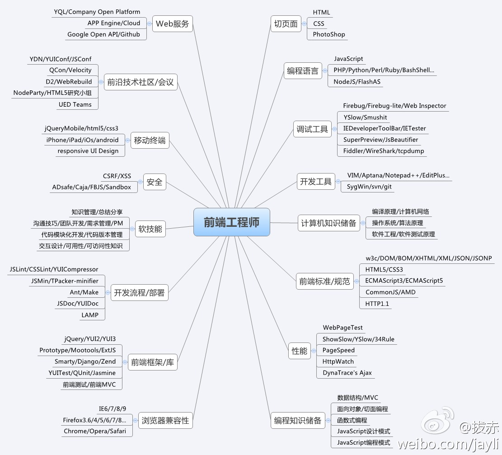

<!-- footer: 艾氪森科技：techaction.cn -->

# H5 周末班 Week 1

huhao
2018-01

---
# 目录

1. 如何学习
1. Web 发展历史
1. git 使用
1. Visual Studio Code 使用
1. DOCTYPE 和 浏览器模式
1. 文档有效性的验证
1. HTML 基本结构，常用元素
1. CSS 选择器, 优先级，层叠，继承
1. 规划和组织样式表

---


# 如何学习

<span style="font-size:72px;">**认真 + 坚持**</span>

---

# 如何学习： 认真 - 常见错误

不要让客户、产品经理、老板、测试发现你少写了分号这种低级错误。

- 拼写错误：`alter("Hello World.");`
- 少写、写错分号：
	- `for (var i = 0, i < 3, i++) console.log(i);`
- 多写分号
	- `for (var i = 0; i < 3; i++); console.log(i);` 
- 少写引号: `var o = {a: 1}; console.log(o[a]);`
- `==` 写成 `=`
	- `var a = 'no'; if (a = 'yes') console.log("yes")` 
- 引号、括号不匹配：
	- `for (var i = 0; i < 10; i++) {if (i %2 == 0) {console.log(i);}` 

---
# 如何学习： 认真 - 常见错误

- 数组下标越界：
	- `var arr = [1, 2, 3]; console.log(arr[3]);`
- 边界处理错误
	- `for (var i = 0; i <= 3; i++) console.log(i);`
- 使用未定义变量：`console.log(foo);`
- 空指针异常：
	- `var o = { a: 1}; console.log(o.b.c);`  
- 类型错误：`var a = 'a', b = 1; a > b;`
- 忘记关闭文件：
	- `var fd = fs.openSync('test.txt', 'r');`
	- `//fs.closeSync(fd);`


[C语言编程时常犯十八个错误](http://c.biancheng.net/cpp/html/1140.html)

---

# 如何学习： 坚持 - 学习曲线


http://www.techug.com/post/beginner-learn-programming.html

---
# 如何学习： 坚持 - 学习阶段

- **手把手辅导的蜜月期**： 充满了乐趣，面对看似棘手的问题，那些高质量资源的鼎力相助让你轻松取胜。虽然你主要学的是基础语法，但完成的工作会让你很有成就感。
- **充满迷惑的下滑期**：你会痛苦地发现，事情变得更困难了，实际上你没法独立做任何事。
- **绝望的迷茫期**： 这个阶段漫长而又孤独。在这个沙漠中几乎没有路，每个方向都看似正确，但你却总是在绕圈，你极度渴望找到办法逃出生天
- **煎熬的上升期**：这个阶段里你终于找到了一条路走出沙漠，并且总体清楚了如何创建应用程序。但你的代码仍然很封闭，到处都是漏洞，就像纸糊的房子一样摇摇欲坠。

---

# 如何学习： 学习方式

- 看视频：入门，建立兴趣
- 看书：提高，体系化，需长期坚持
- 参加培训：指导，互动，氛围，案例
- 看代码：借鉴
- 写代码：实践

https://www.zhihu.com/question/49549517/answer/154915699
https://www.zhihu.com/question/266683138/answer/312398276

1. 目标明确: 能够用 HTML 和 CSS 开发出各大网站的前后台页面
2. 多写代码：Github 用起来，坚持每周提交代码

---

# 如何学习：解决问题

遇到问题是机会，尽量创造机会多遇到一些问题，努力提高解决问题的能力。

方法：遇到问题 -> 分析问题 -> 解决问题 -> 总结问题

>P6是公司干活的骨干、独立的执行者、他们需要独立完成自己的工作。
>对于复杂问题的解决有自己的见解，对于问题的识别、优先级分配有见解，善于寻求资源解决问题；也常常因为对于工作的熟练而有创新的办法，表现出解决问题的能力。

https://www.zhihu.com/question/19733347/answer/58548443
https://www.zhihu.com/question/29834375/answer/46085845

---

# 如何学习： 学会使用搜索引擎

- 词和词之间用空格分开，不要加语气助词
- 有报错信息，尽量搜报错信息，不要太长
- 搜索出来的内容，一般来说，知乎，百科，博客是比较靠谱的
- 可以刷 StackOverflow ，基本上都能解决问题
- 搜索结果中，永远先看官网，找 Reference ，找 5 Min 教程
- 英文词，请用Google或者是Bing
- 搜索的时候不要太过发散，不可能把所有的知识点都解决

https://zhuanlan.zhihu.com/p/22914320

---
# 如何学习： 如何提问


- [提问的智慧](https://github.com/ruby-china/How-To-Ask-Questions-The-Smart-Way/blob/master/README-zh_CN.md)

	- 这是一篇长文，看完需要十几分钟的时间。如果之前没有认真看过并且思考过，这十几分钟会改变你的职业生涯。

	- https://ruby-china.org/topics/24325
- [左耳朵耗子: X-Y PROBLEM](https://coolshell.cn/articles/10804.html)
- [陈硕：提问须知](提问须知)

---


# 如何学习：全栈技能树


https://github.com/phodal/sherlock

---

# 如何学习：前端技能书



https://github.com/JacksonTian/fks

---

# 如何学习：学习顺序

> 先打地基，建房子（html）
然后装修（css）
接着把门，窗户，自来水龙头，电灯开关什么的接好（js）
可是还没有电，也没水，怎么办呢，造发电站，兴修水利发电站（php）
依旧没水没电，修水库，引入水源，水利发电（mysql）

https://www.zhihu.com/question/22646257/answer/102812620

---
# 如何学习：前端入门

>首先学习HTML, CSS, 这两个东西是一套的, 非常容易理解, 把w3school上面的教程过一遍就会了, 记住要一个个过, 千万不要偷懒, 一旦开始偷懒, 你会越来越偷懒, 最后什么都没学成。

https://www.zhihu.com/question/22646257/answer/22113651

- [菜鸟教程：HTML 教程](https://www.runoob.com/html/html-tutorial.html)
- [菜鸟教程：CSS 教程](https://www.runoob.com/css/css-tutorial.html)

---

# Web 发展历史

- Web 诞生: HTML、URL和HTTP
- 动态内容出现：CGI
- Web 编程脚本语言：PHP / ASP / JSP
- 分布式企业计算平台：J2EE / .NET
- 框架横飞的年代：MVC，ORM
- 回归 Web 本质：REST
- 浏览器的魔术：Ajax
- 前端 MVC：Angular / Backbone
- Javascript 在服务端的逆袭：NodeJs


[Web开发技术发展历史](https://www.tianmaying.com/tutorial/web-history)
[Web开发技术的演变](http://blog.jobbole.com/45170/)

---

# git 使用


http://www.ruanyifeng.com/blog/2015/12/git-cheat-sheet.html

---
# git 使用

```
git config --global user.name "xxx"                       # 配置用户名
git config --global user.email "xxx@xxx.com"              # 配置邮件

git init                                                  # 初始化本地git仓库（创建新仓库）
git clone git+ssh://git@192.168.53.168/VT.git             # clone远程仓库

git status                                                # 查看当前版本状态（是否修改）
git add xyz                                               # 添加xyz文件至index
git commit -m 'xxx'                                       # 提交

git pull origin master                                    # 获取远程分支master并merge到当前分支
git push origin master                                    # 将当前分支push到远程master分支
```

[Windows下Git的安装与使用](http://blog.csdn.net/u011130578/article/details/46300347)
 
---

# 习题作业

1. 下载安装 git， 注册 github， 配置公钥
1. 配置 git， 创建仓库，
1. git add , git commit, git push 发布到 github
1. 学习使用 github pages， 创建自己的个人网页

---

# Visual Studio Code

WebStorm(收费), Sublime Text(弹窗), Atom(卡)，Vim(上手慢)

VS Code
 
- 免费，微软出品
- 跨平台
- 性能高，速度快
- 智能补全 
- 内置代码调试
- 内置 Git 
- 集成多种终端
- 插件、主题

---

## VS Code： 常用功能

- 格式化代码: `Alt + Shift + F`
- 自动换行: `Alt + Z`
- 注释切换: `Ctrl + /`
- 全文搜索：`Ctrl + Shift + F`
- 批量改动: 选中单词后 `Ctrl + D`
- 转到定义: `F12` 或 `Ctrl + 单击单词`
- 查找所有引用：`Shift + F12`
- 快速跳转文件：`Ctrl + P`
- 分屏：`Ctrl + 单击文件`
- 重命名(重构): `F2`


---
## VS Code： 常用功能

- 跳转到行： `Ctrl + G`， 或 `Ctrl + E` 输入 `:`
- 文件间跳转：`Ctrl + Tab`
- 整行上下移动：`Alt + 上下方向键`
- 多光标操作：`Alt + 单击` 或 `Alt + Ctrl + 上下方向键`
- 删除一行： `Ctrl + Shift + K`

- git 集成
- 代码片段

---
# 作业练习

1. 下载安装 VS Code
1. 实验上面的快捷键
1. 实验 git 集成功能


可选阅读：[简明 VIM 练级攻略](https://coolshell.cn/articles/5426.html)， VS Code 有 VIM 键映射插件


---

# SGML XML HTML XHTML HTML5

- SGML：Standard Generalized Markup Language, 标准通用标记语言，XML 和 HTML 的父亲。
- XML : Extentsible Markup Language, SGML 的一个子集，没 SGML 复杂，标签可扩展，且有 DTD，可作为元语言，常用于描述和传输数据。
- HTML : HyperTextMark-upLanguage， SGML的一个实例，固定 DTD ，但格式没有 XML 严格，用于显示网页。
- XHTML：HTML 和 XML 合体，有 DTD， 格式也得是良构的。
- HTML5：去掉了 XML 的限制，但增加了一些新的标签，同事可扩展属性。

[A history of HTML](https://www.w3.org/People/Raggett/book4/ch02.html)
[HTML与XML的区别 ](http://www.cnblogs.com/chenzhaohua/p/4718357.html)
[HTML中的标签和元素的区别](https://zhidao.baidu.com/question/1959001585641011980.html)

---

# XML 结构

| XML | 结构| 
| - | :-: |
|  |  | 

对理解 CSS 选择器, CSS 继承以及 Javascript 的 DOM 操作有帮助
https://www.runoob.com/xml/xml-tree.html

https://www.jianshu.com/p/fbfc6c751e34

---


# HTML 格式


---
# XHTML

XHTML 必须是 良构 的 XML，所以

1、XML文件的第一行必须是xml声明
2、XML文件只能有一个跟节点
3、开始的控制标记与结束的控制标记缺一不可
4、空的控制标记必须要有"/"符号
5、属性值的设置必须被"""包围起来
6、所有的控制标记必须满足嵌套的排列
7、英文字符的大小写是有差异的
8、特殊字符的使用

[格式良好的XML文档](http://blog.csdn.net/wuseyukui/article/details/14056979)
[Is there any difference between 'valid xml' and 'well formed xml'?](https://stackoverflow.com/questions/134494/is-there-any-difference-between-valid-xml-and-well-formed-xml)


---

# DOCTYPE


`<!DOCTYPE>` 声明帮助浏览器正确地显示网页。但是如果你的页面没有 `DOCTYPE` 的声明，那么浏览器会进入怪异模式。

- `<!DOCTYPE>` 声明必须是 HTML 文档的第一行，位于 <html> 标签之前。
-  `<!DOCTYPE>` 声明不是 HTML 标签；它是指示 web 浏览器关于页面使用哪个 HTML 版本进行编写的指令。
-  `<!DOCTYPE>` 声明对大小写不敏感。
-  请使用 W3C 的验证器来检查您是否编写了有效的 HTML / XHTML 文档！

http://www.w3school.com.cn/tags/tag_doctype.asp

--- 
# 常见的 DOCTYPE

- HTML4：`<!DOCTYPE HTML PUBLIC "-//W3C//DTD HTML 4.01 Transitional//EN"
"http://www.w3.org/TR/html4/loose.dtd">`
- XHTML: `<!DOCTYPE html PUBLIC "-//W3C//DTD XHTML 1.0 Transitional//EN"
"http://www.w3.org/TR/xhtml1/DTD/xhtml1-transitional.dtd">`
- HTML5: `<!DOCTYPE html>`

<p style="font-size:0.8em">public 这行声明了文档的根元素是 html，它的公共标识符被定义为 "-//W3C//DTD XHTML 1.0 Strict//EN" 的 DTD 中进行了定义。</p>
<p style="font-size:0.8em">浏览器将明白如何寻找匹配此公共标识符的 DTD。如果找不到，浏览器将使用公共标识符后面的URL 作为寻找 DTD 的位置。</p>

---


# 验证 HTML

https://validator.w3.org/ w3c 权威，旧版HTML，XHTML 都可验证
https://html5.validator.nu/ H5 验证，没严格遵守 DTD，一般够用
https://github.com/yaniswang/HTMLHint 验证最弱，要求不高可用

`xhtml-validator.html` `h5-validator.html`

---
# 作业练习

使用 w3c 验证知名网站的 HTML， 理解验证错误的提示信息，比如某元素丢失必要属性，标签没有正确关闭等。

完成如下链接里的练习。

[Debugging HTML](https://developer.mozilla.org/zh-CN/docs/learn/HTML/Introduction_to_HTML/Debugging_HTML)

---


# 浏览器模式

- **混杂模式**：混杂模式通常模拟老式浏览器的行为以防止老站点无法工作，无 doctype 或 IE 6 下使用 XHTML
- **严格标准模式**：必须严格遵守最新标准
- **宽松标准模式**：在执行最新标准的前提下，允许一些弃用的元素，如 font
- **基于框架**：等同于宽松模式，但允许框架集

`document.write(document.compatMode);`
`quirks-mode.html` `doctype01.html`

[怪异模式（Quirks Mode）对 HTML 页面的影响](https://www.ibm.com/developerworks/cn/web/1310_shatao_quirks/index.html)
[Activating Browser Modes with Doctype](https://hsivonen.fi/doctype/)


---
# 作业练习

参考上一页的链接，在多种浏览器里体验混杂模式情况下各个案例的不同表现。

---

# 怪异模式

`quirks-mode.*.html`

- 盒模型不同
- 图片元素的垂直对齐方式不同
- table 元素中的字体继承不同
- inline 元素的大小表现不同
- 元素的百分比高度不同
- 元素的溢出处理不同

理解: 
- 块(block)元素 和 行级(inline)元素
- base line
- replaced 元素 和 non-replaced 行元素

---

# HTML 基本结构，常用元素

```
<!DOCTYPE html>
<html>

<head>
    <meta charset="utf-8">
    <title>Welcome H5</title>
</head>

<body>

    <h1>Welcome H5</h1>

    <p>Go go go.</p>

</body>

</html>

```
https://www.runoob.com/html/html-intro.html

---
# HTML 公共属性

最常用：`class`, `id`, `style`,
可访问性：`title`, `accesskey`, `tab-index`, `dir`, `lang`
H5 新增：`contenteditable`,,`data-*`,`draggable`,`hidden`, `spellcheck`
没有浏览器实现的属性：`*contextmenu`, `*dropzone`, `*translate`

- accesskey: IE 下是获取焦点， Chrome 下是点击
- lang: zh-cmn-Hans-CN	普通话（简体，中国大陆）

`standardattributes.html`

[网页头部的声明应该是用 lang="zh" 还是 lang="zh-cn"？](https://www.zhihu.com/question/20797118)

---
# 作业练习

动手实验每个 HTML 公共属性。

---
# 基本标签（Basic Tags）

```

<h1>最大的标题</h1>
<h2> . . . </h2>
<h3> . . . </h3>
<h4> . . . </h4>
<h5> . . . </h5>
<h6>最小的标题</h6>
 
<p>这是一个段落。</p>
<br> （换行）
<hr> （水平线）
<!-- 这是注释 -->
```

---
# 文本格式化（Formatting）

```
<b>粗体文本</b>
<code>计算机代码</code>
<em>强调文本</em>
<i>斜体文本</i>
<kbd>键盘输入</kbd> 
<pre>预格式化文本</pre>
<small>更小的文本</small>
<strong>重要的文本</strong>
 
<abbr> （缩写）
<address> （联系信息）
<bdo> （文字方向）
<blockquote> （从另一个源引用的部分）
<cite> （工作的名称）
<del> （删除的文本）
<ins> （插入的文本）
<sub> （下标文本）
<sup> （上标文本）
```

---
# 链接（Links）

```
普通的链接：<a href="http://www.example.com/">链接文本</a>
图像链接： <a href="http://www.example.com/"></a>
邮件链接： <a href="mailto:webmaster@example.com">发送e-mail</a>
书签：
<a id="tips">提示部分</a>
<a href="#tips">跳到提示部分</a>
```
[If `<a name=“…”>` is obsolete, what is preferred?](https://stackoverflow.com/questions/16974480/if-a-name-is-obsolete-what-is-preferred)

---

# 图片（Images）

```

```

---
# 样式/区块（Styles/Sections）

```
<style type="text/css">
h1 {color:red;}
p {color:blue;}
</style>
<div>文档中的块级元素</div>
<span>文档中的内联元素</span>
```

---
# 无序列表

```
<ul>
    <li>项目</li>
    <li>项目</li>
</ul>

```
# 有序列表

```
<ol>
    <li>第一项</li>
    <li>第二项</li>
</ol>
```
---
# 定义列表

```
<dl>
  <dt>项目 1</dt>
    <dd>描述项目 1</dd>
  <dt>项目 2</dt>
    <dd>描述项目 2</dd>
</dl>
```
---
# 表格（Tables）

```
<table border="1">
  <tr>
    <th>表格标题</th>
    <th>表格标题</th>
  </tr>
  <tr>
    <td>表格数据</td>
    <td>表格数据</td>
  </tr>
</table>
```

---

# 框架（Iframe）

```
<iframe src="demo_iframe.htm"></iframe>
```

---
# 表单（Forms）

```
<form action="demo_form.php" method="post/get">
  <input type="text" name="email" size="40" maxlength="50">
  <input type="password">
  <input type="checkbox" checked="checked">
  <input type="radio" checked="checked">
  <input type="submit" value="Send">
  <input type="reset">
  <input type="hidden">
  <select>
    <option>苹果</option>
    <option selected="selected">香蕉</option>
    <option>樱桃</option>
  </select>
  <textarea name="comment" rows="60" cols="20"></textarea>
</form>
```

---
# 实体（Entities）

```
&lt; 等同于 <
&gt; 等同于 >
&#169; 等同于 ©

```
---

# 作业练习： HTML 学习

菜鸟 HTML 教程走一遍
https://www.runoob.com/html/html-tutorial.html

以上主要 HTML 标签的每个属性都走一遍
https://www.runoob.com/tags/html-reference.html

---

# CSS： 浏览器如何工作的


http://www.cnblogs.com/wangfupeng1988/p/4276321.html

---

# CSS 规则


https://www.runoob.com/css/css-syntax.html

---
# CSS选择器

- 基本选择器： `*`, `E`, `.info`, `#footer`
- 多元素的组合选择器: `E,F`, `E F`, `E > F`, `E + F`
- CSS 2.1 属性选择器: `E[att]`, `E[att=val]`, `E[att~=val]`, `E[att|=val]`
- CSS 2.1中的伪类: `E:first-child`, `E:link`, `E:visited`, `E:active`, `E:hover`, `E:focus`, `E:lang(c)`
- CSS 2.1中的伪元素: `E:first-line`, `E:first-letter`, `E:before`, `E:after`

http://www.ruanyifeng.com/blog/2009/03/css_selectors.html
https://www.cnblogs.com/wuziyue/p/4808014.html

---

# CSS3 选择器

- CSS 3的同级元素通用选择器: `E ~ F`
- CSS 3 属性选择器：`E[att^="val"]`, `E[att$="val"]`, `E[att*="val"]`
- CSS 3中与用户界面有关的伪类: `E:enabled`, `E:disabled`, `E:checked`, `E::selection`
- CSS 3中的结构性伪类： `E:root`, `E:nth-child(n)`, `E:nth-last-child(n)`, `E:nth-of-type(n)`, `E:nth-last-of-type(n)`, `E:last-child`, `E:first-of-type`, `E:last-of-type`, `E:only-child`, `E:only-of-type`, `E:empty`
- CSS 3的反选伪类: `E:not(s)`
- CSS 3中的 `:target` 伪类: `E:target`

---
# 作业练习


自己写代码熟悉上面的选择器， 参考如下网址

[The 30 CSS Selectors You Must Memorize](https://code.tutsplus.com/tutorials/the-30-css-selectors-you-must-memorize--net-16048)
中文 http://colobu.com/2015/03/10/the-30-css-selectors-you-must-memorize/

---

# CSS 层叠
层叠就是浏览器对多个样式来源进行叠加，最终确定结果的过程


http://www.cnblogs.com/wangfupeng1988/p/4277959.html

---

# CSS 层叠

`cascading.html`

```
<p id="css" class="css" style="color:blue;">
Cascading Style Sheets</p>

#css {	color: orange; }

p    {	color: red !important; }

p    {	color: green; }

.css {	color: yellow; }
```

---
# CSS 样式优先级

内联样式）Inline style > （内部样式）Internal style sheet >（外部样式）External style sheet > 浏览器默认样式

- 通用选择器（*）
- 元素(类型)选择器
- 类选择器
- 属性选择器
- 伪类
- ID 选择器
- 内联样式

---

# CSS !important 

- Always 要优化考虑使用样式规则的优先级来解决问题而不是 !important
- Only 只在需要覆盖全站或外部 css（例如引用的 ExtJs 或者 YUI ）的特定页面中使用 !important
- Never 永远不要在全站范围的 css 上使用 !important
- Never 永远不要在你的插件中使用 !important


---
# CSS 权重计算


https://www.runoob.com/css/css-howto.html

---
# 作业练习

动手实验 CSS 层叠和优先级，了解不同优先级的效果。

---
# CSS 继承

```
    <h1>h1 h1 h1 h1 h1</h1>
    <h2>h2 h2 h2 h2 h2</h2>
    <p>p p p p <span>span span </span>p p p </p>
    <table><tr><td>td td td</td></tr></table>
    <input type="text" name="" id="">
```    

```
    html {
        color: blue;
        font-family: Arial, Helvetica, sans-serif;
        font-size: 2em;
        line-height: 1.5;        
    }
    h1, h2, p, td {
        background-color: #eee;
    }
```
https://github.com/xitu/gold-miner/blob/master/TODO/css-inheritance-cascade-global-scope-new-old-worst-best-friends.md

---
# 哪些属性会继承

1. 一是文本相关的属性，具体有： font-family, font-size, font-style,font-variant, font-weight, font, letter-spacing,line-height，text-align, text-indent, text-transform,word-spacing 
1. 二是列表相关的属性，具体如下： list-style-image, list-style-position,list-style-type, list-style 
1. 还有一个属性比较重要的是 color 属性。

[css有哪些属性可以继承？](https://www.jianshu.com/p/fbfc6c751e34)
[CSS 哪些属性默认会继承, 哪些不会继承?](https://segmentfault.com/q/1010000000269211)
[Which CSS properties are inherited?](https://stackoverflow.com/questions/5612302/which-css-properties-are-inherited)

---

# 作业练习： 理解 CSS 继承

参考如下网址，实验 CSS 继承的行为，哪些属性会继承？`text-indent` 的默认继承对子元素的影响。

[css中可以和不可以继承的属性](http://blog.163.com/yhwwen@126/blog/static/170468853201326421822/)

---
# CSS 规范，模块化，组件化

- 书写规范化：缩进，空格，空行，换行，命名，顺序等
- 语义化: 如使用 `error` 不要用 `red`
- 分层：base.css, layout.css, module.css, themes.css
- 模块化：moduleA.css, moduleB.css moduleC.css
- 组件化：menu.css, button.css, pager.css, carousel.css, tab.css

模块化开发，部署时用构建工具进行合并压缩。

---
# CSS 规范

[AlloyTeam: CSS 规范](http://alloyteam.github.io/CodeGuide/#css-indentation)
[FEX: CSS编码规范](https://github.com/fex-team/styleguide/blob/master/css.md)
[如何规范 CSS 的命名和书写？](https://www.zhihu.com/question/19586885)

---
# 书写顺序

1. 位置属性(position, top, right, z-index,
display, float等)　　
1. 大小(width, height, padding, margin)　　
1. 文字系列(font, line-height, letter-spacing, color- text-align等)　　
1. 背景(background, border等)　　
1. 其他(animation, transition等)

---
# 书写规范

- 注意缩进，空格，空行，换行
- **尽量** 使用属性的缩写方式，transition 等复杂的分开写
- 进制颜色缩写: `background-color: #012;`
- 去掉小数点前的 0 ： `color: rgba(0, 0, 0, 0.5);`
- 属性值 '0' 后面不要加单位：`width: 0;`
- 类名多个单词用 `-` 分割，不要用下划线: `.element-content {}`
- 不要有空选择器
- 尽量少用 id 选择器， id 用驼峰式命名

---
# 作业练习

查看知名大站的 CSS 是否遵循 CSS 书写规范，找出其中不规范的地方，并思考这样做的原因。

---

# CSS 模块化 组件化

简单的写Css并不是一件多难的事情，而要写出一套可维护的Css却是一件相当困难的事情。

[从css谈模块化](https://www.jianshu.com/p/6ce8619dc674)
[Css设计模式-理论篇之OOCSS、SMACSS与BEM](http://blog.csdn.net/u013588178/article/details/49727339)
[CSS分层](https://www.w3cplus.com/css/css-layers.html)


---

# CSS 模块化 组件化

表现与结构分离: `box-padded product-image`
内容与容器分离: `wrapper suggested-products`
减少对 HTML 结构的依赖(最小化适配深度)： `.container-list ul li a` -> `.container-list .list-item`
增强 CSS 样式的复用性：`label label-danger`
Categorizing CSS Rules: `Base` `Layout` `Module` `State` `Theme or Skin`

---

# CSS 模块化

- global.css
- layout.css
- module.css
- themes.css
- mend.css

---
# 作业练习

查看知名大站的 CSS 文件布局，理解其背后意义。
可用 Chrome 开发者工具的 Network 功能，只过滤 CSS 文件。


---
# 浏览器默认样式

```
body { margin: 8px; line-height: 1.12; } 
h1 { font-size: 2em; margin: .67em 0; } 
h2 { font-size:1.5em; margin: .75em 0; } 
h3 { font-size: 1.17em; margin: .83em 0; } 
ol, ul, dd { margin-left: 40px} 
```

[浏览器默认样式对比表](http://developer.doyoe.com/default-style/)
[css知多少（4）——解读浏览器默认样式](https://www.cnblogs.com/wangfupeng1988/p/4280801.html)

---

#  基础样式

基础样式

- reset.css
- normalize.css
- global.css: 全局样式
- base.css

[Normalize.css 与传统的 CSS Reset 有哪些区别？](https://www.zhihu.com/question/20094066)
[CSS reset的重新审视 – 避免样式重置](http://www.zhangxinxu.com/wordpress/2010/04/css-reset%E7%9A%84%E9%87%8D%E6%96%B0%E5%AE%A1%E8%A7%86-%E9%81%BF%E5%85%8D%E6%A0%B7%E5%BC%8F%E9%87%8D%E7%BD%AE/)
[我的 css 框架——base.css](https://www.cnblogs.com/yjzhu/archive/2012/11/05/2755095.html)

---

# 练习作业： 实现自己的 normalize.css

参考如下网址，实现精简版的 normalize.css，理解每个规则的意义，去掉自己认为不必要的规则。

[Normalize.css 介绍与源码解读](http://www.cnblogs.com/hhstuhacker/p/normalize-intro-source-inside.html)


---

# 如何学习 参考链接

- [怎样使自己坚持努力？](https://www.zhihu.com/question/21470362)
- [学编程为什么这么难](http://www.techug.com/post/beginner-learn-programming.html)
- [如果当初学习编程时能有人给我这些忠告该多好](http://blog.jobbole.com/52761/)
- [HTML、CSS、JavaScript、PHP、 MySQL 的学习顺序是什么？](https://www.zhihu.com/question/22646257)
- [零基础学习Web前端开发应该先学什么？（IT 修真院 CSS 任务）](https://www.zhihu.com/question/47004688/answer/168527985)
- [零基础应该选择学习 java、php、前端 还是 python？](https://www.zhihu.com/question/40801731/answer/89402709)

---

# git 相关链接

- [常用 Git 命令清单](http://www.ruanyifeng.com/blog/2015/12/git-cheat-sheet.html)

- [Git快速入门](https://www.jianshu.com/p/db3396474b96)
- [廖雪峰：Git教程](https://www.liaoxuefeng.com/wiki/0013739516305929606dd18361248578c67b8067c8c017b000)
- [通过git在github上建立gh-pages分支并查看网页效果](https://www.cnblogs.com/ManSenal/p/6222173.html)

---

## VS Code 参考链接

- [学会用好 Visual Studio Code](http://blog.csdn.net/GarfieldEr007/article/details/54619959)
- [Visual Studio Code 最好的功能、插件和设置](http://www.css88.com/archives/8144)
- [突如其来的Visual Studio Code为何这么热门](http://mdsa.51cto.com/art/201504/474814_all.htm)
- [如何评价 Visual Studio Code（《设计模式》作者率队打造）](https://www.zhihu.com/question/29984607)
- [如何评价 GitHub 发布的文本编辑器 Atom？(编辑器之争)](https://www.zhihu.com/question/22867204)
- [Atom、Sublime Text、VSCode 三者比较，各有哪些优势和弱势？](https://www.zhihu.com/question/41857899)
- [为什么我选择使用 VS Code进行前端开发?](https://zhuanlan.zhihu.com/p/28631442)
- [Microsoft Visual Studio Code 中文手册](https://jeasonstudio.gitbooks.io/vscode-cn-doc/content/)
- [Visual Studio Code 常用快捷键](http://www.cnblogs.com/bindong/p/6045957.html)
- [使用Visual Studio Code打开浏览器查看HTML文件](https://www.cnblogs.com/undefined000/p/5466626.html)

---
# 浏览器怪异模式 参考链接

[Css styles not applied properly,if use DOCTYPE](https://stackoverflow.com/questions/10380346/css-styles-not-applied-properly-if-use-doctype)
[Is quirks mode relevant in 2011?](https://stackoverflow.com/questions/6404635/is-quirks-mode-relevant-in-2011)
[Discover Quirks Mode in IE](https://stackoverflow.com/questions/17949986/discover-quirks-mode-in-ie)
[How to detect Render Mode of browser for current page?](https://stackoverflow.com/questions/623047/how-to-detect-render-mode-of-browser-for-current-page)
[IE vs Chrome quirks mode](https://stackoverflow.com/questions/37098986/ie-vs-chrome-quirks-mode)
[Quirks Mode Living Standard ](https://quirks.spec.whatwg.org/)

---
# 前端学习 参考链接

- [IT 修真学院：用html+css制作一个网页](http://www.jnshu.com/task/1/33/detail//#0)
- [实验楼：HTML 基础入门](https://www.shiyanlou.com/courses/19)
- [实验楼：CSS速成教程](https://www.shiyanlou.com/courses/53)
- [电商站首页布局实战(主要看截图，然后实现它)](https://www.bilibili.com/video/av8710320/)
- [web前端开发书单)](https://www.zhihu.com/question/31059577)

