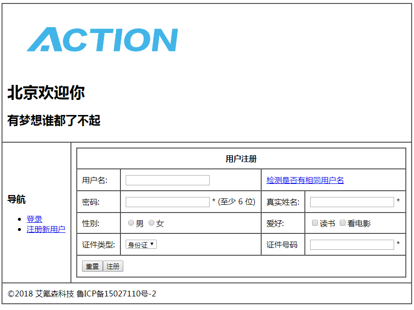

# HTML CSS 基础

---

## 示例

```
<!DOCTYPE html>
<html>
<head>
<meta charset="utf-8">
<title>艾氪森科技(techaction.cn)</title>
</head>
<body>
    <h1>我的第一个标题</h1>
    <p>我的第一个段落。</p>
</body>
</html>
```

后缀名: `.html` 或 `.htm`

---
## HTML

HTML 不是编程语言，是标记语言

文档类型：`<!DOCTYPE html>`

编码：`<meta charset="utf-8">`

---

## 标签、元素、属性

**标签格式**：`<标签>内容</标签>`， 成对出现，不要忘记结束标签，空元素不需要关闭， 全部小写

**必备标签**：`html`, `head`, `body`, `meta`, `title`

**元素**：通常和标签一个意思，但严格来说是包含开始和结尾一对标签。

**属性**：属性名小写，属性值双引号扩住。

**常见属性**: `class`, `id`, `style`, `title`

---

## 编辑器和浏览器

Notepad++: 新建文件，输入 HTML 代码，保存为 `.html` 后缀

- 注意代码缩进
- 适当增加注释


Chrome ：打开 `.html` 文件
- 先用 `file:///` 方式打开，真实环境是用 `http://` 方式打开


---

## 标题，段落，链接，图片

```
<h1>我的第一个标题</h1>
<p>我的第一个段落。</p>   
<a href="http://techaction.cn">这是一个链接</a>

```

---
## 参考手册


学会查[参考手册](https://www.runoob.com/tags/html-reference.html)：

- 注意 **废弃属性** 和 **必备属性**： 比如 `p` 标签里的 `align` 属性 已经废弃，`img` 标签里必须有 `alt` 属性
- 注意父标签和子标签的规则：比如 `td` 元素 必须在 `tr` 元素里
- 注意元素的默认样式：如 `h1` `p` 元素默认的外边框，`a` 元素默认是有颜色的。
- 多个属性间的关系，比如 `a` 标签里如果没有 `href` 属性，则不能设置 `target ` 等属性
- 留意哪些是 `HTML5` 新增的属性

---
## H1 标签和 title 

一般来说一个页面只能有一个 h1 标签，可以有多 h2, h3, h4 标签。

从 SEO 角度来看，h1 标签一般用于每个页面最重要的地方，其作用价值不小于 title。

---

## a 元素

- 下载图片
`<a href="../images/logo.png" download="techaction">下载 Logo</a>`

- 新窗口打开
`<a href="http://techaction.cn" target="_blank">艾氪森</a>`

- 锚点
`<a href="#anchor1">链接到第一小节</a>
<a id="anchor1" style="position:absolute;left: 0;top: 2000px;">第一小节</a>
`

---
## a 元素

- 站内链接
`<a href="standardattributes.html">站内链接，相对路径</a>`
- 同协议站外网址
`<a href="//techaction.cn">链接到同协议站外网址</a>`
- 图像链接
`<a href="https://techaction.cn"> </a>`
- 电子邮件
`<a href="mailto:support@techaction.cn?subject=%E9%97%AE%E9%A2%98%E6%B1%82%E5%8A%A9">联系我们</a>`

---
# 如何让一个区域可点击

[Make a div into a link](https://stackoverflow.com/questions/796087/make-a-div-into-a-link)
[“Block-level” links in HTML5](http://html5doctor.com/block-level-links-in-html-5/)

```
<a href="story1.html">
  <h3>Bruce Lawson voted sexiest man on Earth</h3>
  <p>
  A congress representing all the planet'...</p>
  <p>Read more</p>
</a>
```
---
## 查看改动历史

[HTML 标签练习改动历史](https://github.com/onlytiancai/front-end-weekend/commits/gh-pages/week1/html.html)

---

## img 元素

- HTML5 中 ` ` 里的 `/` 可以省略
- `src` 和 `alt` 属性是必须的， 后者用于图片不能显示时文字提示
- `width` 和 `height` 尽量写，图片下载慢时，浏览器先显示占位符，防止闪屏
- [图像地图](https://www.runoob.com/try/try.php?filename=tryhtml_areamap)

---

## 空格、换行、横线

 `&nbsp;` `<br>`, `<hr>`

所有连续的空行和空格，都算做一个空格。

`<br>` 是硬回车，和段落不一样，两行之间没有合适的边距。

`&nbsp;` 是 HTML 实体，解析出来后就是空格，可以连续写多个。其它常用实体如 `&copy;`

---

## 注释

`<!-- -->`

[查看源码](http://demos.jquerymobile.com/1.4.0/pages-multi-page/)

---

## 文本格式化
类似 Word 里的格式化工具，HTML 里也可以对文字进行各种格式化


```
<strong>这个文本是加粗的</strong>
<em>这个文本是斜体的</em>
<del>我被删除了</del>
<ins>我有下划线</ins>
这里用一个短的代码: <code>var x = y + 1;</code>
<p>鲁迅说过：<q>这个我真没说过。</q></p>
```
---

## 文本格式化

- 加粗(`strong`)，斜体(`em`)，删除线(`del`)，下划线(`ins`)，加大(`big`)，缩小(`small`)，上标(`sub`)，下标(`sup`)

- 语义化：通常标签 `<strong>` 替换加粗标签 `<b>` 来使用, `<em>` 替换 `<i>`标签使用。
- `q` 定义短引用, 文字会有引号括住，`blockquote` 定义长引用，默认会有缩进。
- `code` 定义短代码，`pre` 定义长的预格式文本，保留空格和换行符，呈现为等宽字体，常用于显示大段代码。
- 计算机输出（不常用）：`code`, `kbd`, `samp`, `var`

---

## 简单表格


	<table>
		<tr>
			<td>1</td>
			<td>2</td>
		</tr>
		<tr>
			<td>3</td>
			<td>4</td>
		</tr>
	</table>


---

## 带边框表格

	<table border="1">
		<tr>
			<td>1</td>
			<td>2</td>
		</tr>
		<tr>
			<td>3</td>
			<td>4</td>
		</tr>
	</table>

---

## 带单元格间距表格

	<table border="1" cellspacing="0">
		<tr>
			<td>1</td>
			<td>2</td>
		</tr>
		<tr>
			<td>3</td>
			<td>4</td>
		</tr>
	</table>
---

## 带单元格内边距表格

	<table border="1" cellpadding="10" >
		<tr>
			<td>1</td>
			<td>2</td>
		</tr>
		<tr>
			<td>3</td>
			<td>4</td>
		</tr>
	</table>

---

## 带表头表格

	<table border="1" >
		<tr>
			<th>编码</th>
			<th>姓名</th>
		</tr>
		<tr>
			<td>1</td>
			<td>张三</td>
		</tr>
	</table>
---

## 跨行表格

	<table border="1">
		<tr>
			<td colspan="2">1</td>
		</tr>
		<tr>
			<td>3</td>
			<td>4</td>
		</tr>
	</table>

---

## 跨列表格

	<table border="1">
		<tr>
			<td rowspan="2">1</td>
			<td>2</td>
		</tr>
		<tr>			
			<td>4</td>
		</tr>
	</table>
    
---

## 语义化的表格
	<table border="1">
		<caption>绩效表格</caption>
		<thead>
			<tr>
				<th>姓名</th><th>数量</th>
			</tr>
		</thead>
		<tbody>
			<tr>
				<td>张三</td><td>20</td>
			</tr>
			<tr>
				<td>李四</td>	<td>30</td>
			</tr>
		</tbody>
		<tfoot>
			<tr>
				<td>总计</td><td>50</td>
			</tr>
		</tfoot>
	</table>
---
### 列控制
	<table border="1">
		<colgroup>
			<col span="2" style="background-color:red">
			<col style="background-color:yellow">
		</colgroup>
		<tr>
			<th>ISBN</th><th>Title</th><th>Price</th>
		</tr>
		<tr>
			<td>3476896</td><td>My first HTML</td><td>$53</td>
		</tr>
		<tr>
			<td>5869207</td><td>My first CSS</td><td>$49</td>
		</tr>
	</table>
---

## HTML 列表

无序列表

	<ul>
		<li>Coffee</li><li>Milk</li>
	</ul>

有序列表

	<ol>
		<li>Coffee</li><li>Milk</li>
	</ol>
	
自定义列表

	<dl>
		<dt>Coffee</dt><dd>black hot drink</dd>
		<dt>Milk</dt><dd>white cold drink</dd>
	</dl>
    
---

## HTML 列表

- 注意默认的缩进样式
- `li` 里可以再继续嵌套 `ul`, `ol`，以及 `p` 等

---
### div 和 span

- 块元素：占满整行，下一个元素在下一行，如 `h1`, `p`, `ul`, `table` 等
- 行元素：在一行内布局，不会换行， 如 `a`， `img`, `strong` 等
- `div｀：块元素，用于其它元素的容器，常用于布局，语义上无意义
- `span`：行元素，用于文本的容器，可单独为某些文本设置样式，语义上无意义

---

## 简单表单

	<form action="/login" method="post" 
        enctype="application/x-www-form-urlencoded">
		<p>用户名：<input type="text" value=""></p>
		<p>密码：<input type="password" value=""></p>
		<p><input type="reset" value="重置">
        <input type="submit" value="登录"></p>
	</form>

- `form` 的 `action` 必填, `method` 默认值为 `get`
- `input` 的 `name` 必填，服务端读取时需要
- `input` 不能脱离 `form` 使用
- 多行文本使用 `textarea` 标签
- 上传文件时 `input` 的 `type` 属性为 `file`，且 `form` 的 `enctype` 属性需为 `multipart/form-data`

---
## 单选框和多选框

	<form action="/register" method="post">
		<p>性别：<label><input type="radio" 
        	name="sex" value="male">男</label>
		<label><input type="radio" 
        	name="sex" value="female">女</label></p>
            
		<p>爱好：<label><input type="checkbox" 
        	name="interest" value="reading">读书</label>
		<label><input type="checkbox" 
        	name="interest" value="film">看电影</label></p>
	</form>

- `name` 相同为一组
- `lable` 的使用，扩大可点击区域

---

## 下拉列表

	<form action="">
	<select name="cars">
		<option value="volvo">Volvo</option>
		<option value="saab">Saab</option>
		<option value="fiat">Fiat</option>
		<option value="audi">Audi</option>
	</select>
	</form>

- `value` 是发送给服务端的数据
- `option` 的文本只用于显示
- `select` 可设置 `multiple` 属性，实现多选

---
## 综合练习




