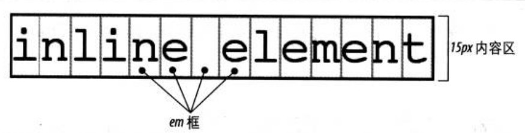
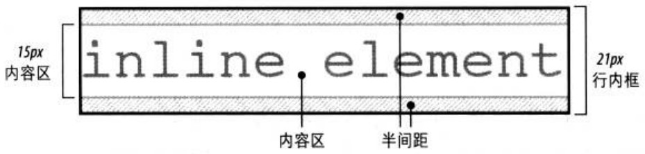

# 艾氪森 H5 周末班 Week3

---
# 目录

- Box Model
- display
- position
- offset
- float

---

# Box Model

所有文档元素都生成一个矩形框，这称为元素框(element box)

[深入理解盒模型](http://www.cnblogs.com/xiaohuochai/p/5202597.html#anchor3)

---
# display

- block：块元素，独占一行，支持设置 `width`, `height`
- inline: 行元素，不换行，不支持设置 `width`, `height`
- inline-block: 类似行元素，但支持设置 `width`， `height`
- none：隐藏，并脱离文档流。

---

# position

- `static`: 元素框正常生成。块级元素生成一个矩形框，作为文档流的一部分，行内元素则会创建一个或多个行框，置于其父元素中
- `relative`: 元素框偏移某个距离。元素仍保持其未定位前的形状，它原本所占的空间仍保留
- `absolute`: 元素框从文档流完全删除，并相对于其包含块定位，包含块可能是文档中的另一个元素或者是初始包含块。
- `fixed`: 元素框的表现类似于将position设置为absolute，不过其包含块是视窗本身

定位元素是指 `position` 不为 `static` 的元素。

---
# offset

只针对定位元素，

- left
- right
- top
- bottom

[深入理解CSS定位中的偏移](http://www.cnblogs.com/xiaohuochai/p/5289143.html)

---
# float

元素浮动后会脱离文档流

- left
- right

清除浮动

- 后面的元素用 `clear: left` 
- 或父元素用 `overflow: hidden`

---
# 练习

写例子，实验 盒模型，定位，偏移和浮动。

---

# 术语解释：基本框

- CSS假定每个元素都会生成一个或多个矩形框，这称为元素框。
- 各元素框中心有一个内容区。这个内容区周围有**可选**的内边距、边框和外边距。
- 内容的背景也会应用到 padding。margin 通常是透明的，从中可以看到父元素的背景。
- padding 不能是负值，但是 margin 可以。
- 对元素的呈现，块级元素的处理不同于行内元素，而浮动元素和定位元素也分别有着各自不同的表现。

[理解CSS视觉格式化](http://www.cnblogs.com/xiaohuochai/p/6252163.html)

---

# 术语解释： 包含块

- 每个元素都相对于其包含块摆放，包含块就是一个元素的布局上下文。
- 对于正常的文本流中的一个元素而言，包含块由最近的块级祖先框、表单元格或行内块祖先框的内容边界构成。

---
# 术语解释：文档流

文本从左向右、从上向下显示，是传统 HTML 文档的文本布局。

---
# 术语解释：根元素

位于文档树顶端的元素，在 HTML 文档中，是元素 html，不是 body。

---
# 术语解释：替换元素和非替换元素

- 替换元素：指作为其他内容占位符的一个元素， 如 `img`、`video`、`audio` 等。
- 非替换元素：如果元素的内容包含在文档中，则称之为非替换元素，如 `span`, `a` 等。

---
# 术语解释：auto

- 水平格式化中： margin-left、width、margin-right 可以设置为 auto
	- width 指定，margin auto， 可实现居中。
	- margin 指定，width auto，内容区域自动撑满剩余空间。
	- 如果元素是替换元素，如　img, width auto 指的是元素固有宽度，也就是 img 居中 width 不需要设置也可以。
	- 其它复杂情况，暂不考虑 
- 垂直格式化中：margin-top、height、margin-bottom 可以设置为 auto
	- 块元素 `height: auto`，正好包含内容高度。
	- margin auto，它会自动计算为 0
	- 对于定位元素的上下 margin auto，有特殊情况，暂不考虑。

---

# 术语解释：行布局

- 匿名文本：未包含在行内元素中的字符串
- em 框：`font-size` 的值确定了各个 em 框的高度
- 内容区：内容区类似于一个块级元素的内容框
	- 非替换元素：元素中各字符的 em 框串在一起构成的框。
	- 替换元素：元素固有高度，加可选的边框，边距。
- 行间距：font-size和line-height之差, 只应用于非替换元素。 
- 行内框：
	- 非替换元素，元素行内框的高度等于 line-height 的高度
	- 替换元素，元素行内框的高度则恰好等于内容区的高度。
	- 行内框的区域与内联元素背景颜色所在的区域无关。
- 行框：行框是包含该行中出现的行内框的最高点和最低点的最小框。

---

---

## 盒模型：width, height

- 块级元素

	- 指定高度大于显示内容所需高度，多余的高度会产生一个视觉效果，就好像有额外的内边距一样
	- 指定高度小于显示内容所需高度，浏览器的具体行为取决于 `overflow` 属性，如出现滚动条
- 行元素
	- 无法应用到行内非替换元素
	- 可应用于替换元素，如 `img`，应用一侧，另一侧自动按比例缩放

---
## 盒模型：宽和高的 auto

块元素

- 宽度设置为 `auto`，则会尽可能的宽，撑满容器。
	- 元素宽度：包含块宽度—元素水平外边距-元素水平边距宽度-元素水平内边距
- 高度设置为auto，则会尽可能的窄
	- 元素高度：恰好满足起内容高度。

IE 6 的宽高包含了 `padding` 和 `border` 的大小。

---

## 盒模型：最大最小宽高

`min-width` | `min-height` | `max-width` | `max-height`

- 设置最大最小宽高的好处是可以相对安全地混合使用不同的单位。
- 使用百分数大小的同时，也可以设置基于长度的限制

demo

IE 6 不支持

---
## 盒模型：内边距

- 块元素：没有什么兼容性，也没有一些特殊的问题
- 行元素：左内边距应用到元素的开始处，右内边距应用到元素的结尾处，垂直内边距不影响行高，但会影响自身尺寸。demo
	- 尽量不要给行元素设置上下 `padding`
- 内边距不能是负值

---
## 盒模型：百分比 padding

- 块元素：相对于包含块的宽度，`padding: 50%` 可实现正方形，常用于头图。demo
- 行元素：如果给行元素使用 `padding`，要配合使用 `font-size: 0`，否则会出现多余空白。 demo

---
## 盒模型：浏览器默认 padding 行为

- 所有浏览器input/textarea/button都内置padding
- 部分浏览器select下拉内置padding，firefox、IE8+可以设置padding
- 除IE10-以外的其他浏览器，radio/checkbox单选复选框无内置padding，无内置border，且无法设置。
- `button` 的 `padding` 在各浏览器下表现不一致，可用 `label` + `for` 属性 进行兼容, button 隐藏。
- firefox和IE8+浏览器在 `overflow:scroll` 或 `auto` 时，存在 `padding-bottom` 缺失现象

---

## 盒模型： margin

- 在元素外创建空白，透明，并显示父元素背景颜色。
- 可以应用在行元素，但上下边距是不起作用的。

---

## 盒模型： 百分比 margin

百分数: 相对于包含块的 width

- 普通元素的 margin 百分比相对于块级父级元素的 width
- 定位元素的 margin 百分比相对于定位父级的 width

demo

---

# 盒模型： margin 4 个值的顺序

【1个值】margin: (top, right, bottom, left);
【2个值】margin: (top, bottom) (left, right);
【3个值】margin: top (left, right) bottom;
【4个值】margin: top right bottom left;

---
## 盒模型：border

位于内边距和外编剧之间，由粗细，颜色和样式构成

- 简写：`border: 5px solid red;`
- 各方向分别设置：`border-top`， `border-bottom`, `border-left`, `border-right`
- 各属性分别设置：`border-style`, `border-width`, `border-color`
- 详细设置：`border-right-color`
- 行元素设置边框：边框实际上画在各行之外的下一个像素上，由于各行紧挨着，所以其边框会重叠, 一般不给行元素设置边框。

[理解CSS边框border](http://www.cnblogs.com/xiaohuochai/p/6244492.html)

---
## 盒模型：outline

在边框外面，用于突出显示元素，常用于输入框获取焦点时

---
## 盒模型：box-sizing

- content-box：默认情况，只包含内容
	- form中的部分元素还是基于IE的怪异盒模型
- bordrer-box: 元素视觉大小，最近流行，包含 padding 和 border

---

## display

[深入理解display属性](http://www.cnblogs.com/xiaohuochai/p/5202761.html)

---
## display: bolck

- 不设置宽度时，宽度为父元素宽度
- 独占一行
- 支持宽高

常见元素：`<blockquote><body><dd>
<dl><dt><form><h1><
<html><ol><option>
<ul>`

不支持的样式：`vertical-align`

---
## display: inline

- 内容撑开宽度
- 非独占一行
- 不支持宽高
- 代码换行被解析成空格

常见元素：`<a> <cite><code><em><label><pre><q><strong>`

不支持的样式：`background-position,clear,height,width,overflow,text-align,text-indent`

---

## display: inline-block

特性

- 不设置宽度时，内容撑开宽度
- 支持宽高
- 其它同 inline

说明
- 默认 inline-block 元素：`<button><input><progress><select><textarea>`
- 具有 inline-block 特性的元素：`audio、canvas、iframe、img、keygen、object、video`
- IE7: 首先将其变成行内元素，使用具有行内元素的特性，然后触发haslayout，使其具有块级元素的特性

---

# inline-block 去除间隙

[去除inline-block元素间间距的N种方法](http://www.zhangxinxu.com/wordpress/2012/04/inline-block-space-remove-%E5%8E%BB%E9%99%A4%E9%97%B4%E8%B7%9D/)

demo

- 去掉空格和换行
- 利用注释
- 使用负 margin
- 使用 font-size: 0
- 使用 word-spacing 和 letter-spacing

---
## display: none

隐藏元素并脱离文档流

`<base><link><meta><title><script><style>`

---
## display: list-item

- 不设置宽度时，宽度撑满一行
- 独占一行
- 支持宽高

---

## display: table

- 不设置宽度时，宽度由内容撑开
- 独占一行
- 支持宽高
- 默认具有表格特征，可设置border-collapse、border-spacing等表格专有属性

当 `border-collapse:separate` 时， margin 和 padding 都可设置， 当 `border-collapse:collapse` 时，只能设置 margin

---
## display: table-cell

- 不设置宽度时，宽度由内容撑开
- 非独占一行
- 支持宽高
- 垂直对齐
- 同级等高
- display:table-cell 的元素不可以设置margin，但可以设置padding

