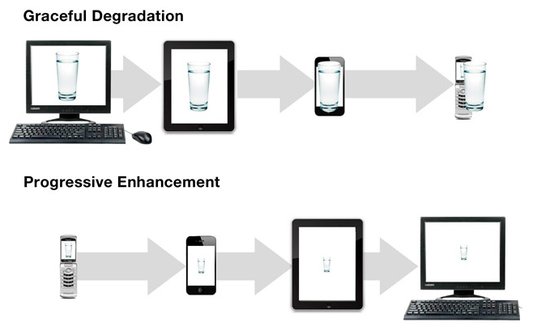
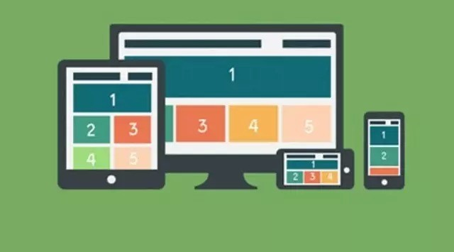
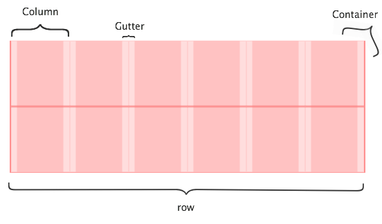
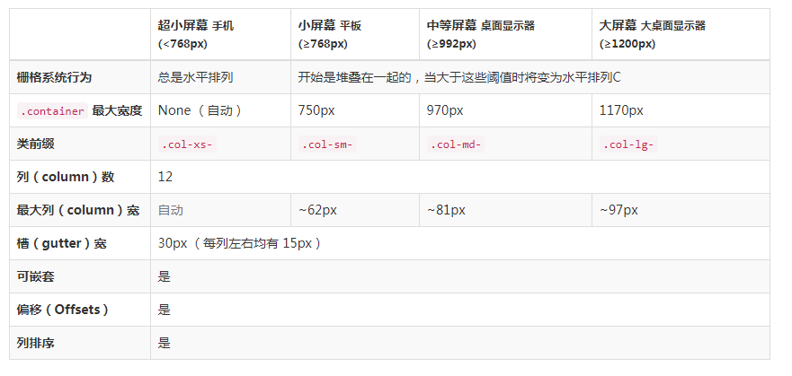

# 艾氪森 H5 周末班 week 6

---
# 目录

- Normalize.css
- 响应式设计
- 栅格系统
- Bootstrap
 
---

# [Normalize.css](http://jerryzou.com/posts/aboutNormalizeCss/)

[Normalize.css 源码](https://github.com/necolas/normalize.css/blob/master/normalize.css)
[Eric Meyer’s “Reset CSS”](https://meyerweb.com/eric/tools/css/reset/)

Normalize.css 是一种 CSS reset 的替代方案。相比于传统的CSS reset，Normalize.css是一种现代的、为HTML5准备的优质替代方案。


- 保护了有价值的默认值
- 修复了浏览器的bug
- 不会让你的调试工具变的杂乱
- 模块化
- 拥有详细的文档

---
# 渐进增强 VS 优雅降级



https://www.jianshu.com/p/d313f1108862

---

## 优雅降级

优雅降级观点认为应该针对那些最高级、最完善的浏览器来设计网站。而将那些被认为“过时”或有功能缺失的浏览器下的测试工作安排在开发周期的最后阶段，并把测试对象限定为主流浏览器（如 IE、Mozilla 等）的前一个版本。

## 渐进增强

渐进增强观点则认为应关注于内容本身。优先考虑老版本浏览器的可用性，最后才考虑新版本的可用性

## 如何选择

如果低版本用户居多，当然优先采用渐进增强的开发流程；
如果高版本用户居多，为了提高大多数用户的使用体验，那当然优先采用优雅降级的开发流程。

---

# 响应式设计



http://www.cnblogs.com/Mtime/p/5184707.html

---

# 响应式设计

响应式Web设计(Responsive Web design)的理念是页面的设计与开发应当根据设备环境（屏幕尺寸、屏幕定向、系统平台等）以及用户行为（改变窗口大小等）进行相应的响应和调整。

简单理解就是可以让一个网站兼容多个终端，而不是为每个终端做一个特定的版本

- 开发、维护、运营成本优势: 页面只有一个
- 兼容性优势: 自动兼容层出不穷的不同尺寸的移动设备
- 操作灵活：可以只对必要的页面进行改动，其他页面不受影响

http://www.visionunion.com/article.jsp?code=201407030012


---
# 响应式设计： viewport

http://www.cnblogs.com/Mtime/p/5184707.html

- viewport 翻译为中文为"视区/视窗/视口"，就是指用户网页的可视区域。

- 手机浏览器把页面放在一个虚拟的 viewport 中，通常比屏幕宽
	- 网页不会挤在一起，但会破坏网页的布局

设置 viewport
`<meta name="viewport" content="width=device-width,height=device-height,inital-scale=1.0,maximum-scale=1.0,user-scalable=no;" />`

---

# 响应式设计：媒体查询

@media 可以针对不同的屏幕尺寸设置不同的样式

```
body{
    background-color:lightgreen;
}

@media only screen and (max-width:600px){
    body{
        background-color:lightblue;
    }
}
```

断点

```

[class*="col-"]{ } /* 移动端优先 */
@media only screen and (min-width: 600px){ } /* 平板 */
@media only screen and (min-width: 768px){ } /* 桌面： */
```

---
# 响应式图片

```
img{
   width:100%;   
}

img {
    max-width:100%;
}

img {
    width: 10%;
	min-width: 300px;
}
```
---
# 响应式背景

background-size

```
    background: url('../images/bg.jpg') no-repeat;
    /* background-size: 100% 100%; */
    background-size: cover;
    /* background-size: contain; */
```

动态图片

```
body{
    background:url('images/xi.jpg') no-repeat;
}

/* 设备大于 400px： */
@media only screen and (min-width:400px){
    body{
       background-image: url('images/xi-big.jpg');
    }
}
```

---

# 栅格系统



[制作你自己的栅格系统 CSS](https://www.jianshu.com/p/9f00d36a79e8)

---

# 栅格系统 container

```
.container {
    width: 100%;
    max-width : 1200px; 
}

.container * { 
    box-sizing: border-box
}
```

---

# 栅格系统 row

```
.row:before,
.row:after {
    content: "";
    display: table;
    clear: both;
}
```

---
# 栅格系统 col

```
[class *= 'col-'] {
    float: left;
    min-height: 1px;
    padding: 12px; /* 设置间距 */
}
.col-1 { width: 16.66%; } 
.col-2 { width: 33.33%; } 
.col-3 { width: 50%; } 
.col-4 { width: 66.664%; } 
.col-5 { width: 83.33%; } 
.col-6 { width: 100%; }

```

---

# 栅格系统 响应式

```
@media all and (min-width: 769px) {
    .col-md-1 { width: 16.66%; } 
    .col-md-2 { width: 33.33%; } 
    .col-md-3 { width: 50%; } 
    .col-md-4 { width: 66.664%; } 
    .col-md-5 { width: 83.33%; } 
    .col-md-6 { width: 100%; }
}

@media all and (max-width: 768px) {
    .col-sm-1 { width: 16.66%; } 
    .col-sm-2 { width: 33.33%; } 
    .col-sm-3 { width: 50%; } 
    .col-sm-4 { width: 66.664%; } 
    .col-sm-5 { width: 83.33%; } 
    .col-sm-6 { width: 100%; }
}
```

---
# Bootstrap

Bootstrap 由 Twitter 的设计师 Mark Otto 和 Jacob Thornton 合作开发，是一个 CSS/HTML 框架。

- 为所有开发者、所有应用场景而设计
- 响应式布局
- 移动设备优先


[教程：Bbootcss](http://v3.bootcss.com/)
[皮肤：Bootswatch](https://bootswatch.com/)
[模版：DesignBootstrap](http://www.designbootstrap.com/)
[站点：Bootstrap 优站精选](http://www.youzhan.org/)
[布局：iBootstrap](http://www.ibootstrap.cn/)
[后台：Ace Admin， Metronic, Admin LTE 等](https://www.cnblogs.com/webenh/p/5815732.html)

---
# Bootstrap 文件

```
bootstrap/
├── css/
│   ├── bootstrap.css
│   ├── bootstrap.css.map
│   ├── bootstrap.min.css
│   ├── bootstrap.min.css.map
│   ├── bootstrap-theme.css
│   ├── bootstrap-theme.css.map
│   ├── bootstrap-theme.min.css
│   └── bootstrap-theme.min.css.map
├── js/
│   ├── bootstrap.js
│   └── bootstrap.min.js
└── fonts/
    ├── glyphicons-halflings-regular.eot
    ├── glyphicons-halflings-regular.svg
    ├── glyphicons-halflings-regular.ttf
    ├── glyphicons-halflings-regular.woff
    └── glyphicons-halflings-regular.woff2
```

---

# Bootstrap 基本模版

```
<!DOCTYPE html>
<html lang="zh-CN">
  <head>
    <meta charset="utf-8">
    <meta http-equiv="X-UA-Compatible" content="IE=edge">
    <meta name="viewport" content="width=device-width, 
        initial-scale=1">
    <!-- 上述3个meta标签*必须*放在最前面，任何其他内容
        都*必须*跟随其后！ -->
    <title>Bootstrap 101 Template</title>

    <!-- Bootstrap -->
    <link href="bootstrap.min.css" rel="stylesheet">

    <!-- HTML5 shim 和 Respond.js 是为了让 IE8 支持 HTML5 元素
        和媒体查询（media queries）功能 -->
    <!--[if lt IE 9]>
      <script src="html5shiv.min.js"></script>
      <script src="respond.min.js"></script>
    <![endif]-->
  </head>

```

---
# Bootstrap 基本模版 2

```
  <body>
    <h1>你好，世界！</h1>

    <!-- jQuery (Bootstrap 的所有 JavaScript 插件都依赖
        jQuery，所以必须放在前边) -->
    <script src="query.min.js"></script>
    <!-- 加载 Bootstrap 的所有 JavaScript 插件。你也可以根据
    需要只加载单个插件。 -->
    <script src="bootstrap.min.js"></script>
  </body>
</html>
```

---

---
# Bootstrap 布局容器

定宽
```
<div class="container">
  ...
</div>
```
全屏
```
<div class="container-fluid">
  ...
</div>
```

---

# Bootstrap 栅格

- `.container > .row >col-*-*`
- 响应式重置、列偏移、嵌套列、列排序



---

# Bootstrap 基础元素

- h1 .. h6, p, .text-center, .text-lowercase, blockquote 
- ul, ol, .list-unstyled, .list-inline, dl, dt, dd
- code, kbd, pre
- table, .table-striped, .table-bordered, .table-hover, .table-condensed, .table-responsive
- .active, .success, .info, .warning, .danger

---
# Bootstrap 表单

- form, form.form-inline, form.form-horizontal
  - div.form-group
      - label, label.col-sm-2.control-label
      - input.form-control,select.form-control
      - p.help-block
  - div.checkbox, div.radio
  	- lable
  		- input[type=checkbox], input[type=radio]
  - button.btn.btn-default

- 控件大小：.input-lg， .input-sm, .form-group-lg, .form-group-lg
- 按钮：.btn .btn-default, btn-primary, btn-success, btn-info, btn-lg, btn-sm

---

# Bootstrap 帮助类 

- 响应式图片：.img-responsive, 
- .center-block，.text-center
- 情景文本：.text-muted, .text-success, .text-warning
- 情景背景：.bg-success, .bg-info, .bg-warning
- .pull-left， .pull-right, .clearfix
- .show, .hidden
- .visible-*-*, .hidden-*-*

---

# Bootstrap 常用组件

- 字体图标
- 导航条
- 标签页
- 面包屑导航
- 列表组
- 面板
- 警告框
- 按钮组

---

# Bootstrap 常用 Javascript 组件
- 模态窗口
- 下拉菜单
- 标签页
- 工具提示
- 弹出框
- 警告框
- 轮播
- 收缩

---

# 综合示例

- 能力评估报告
	- echart
	- timeline
- QCloud 首页

---

# 谢谢